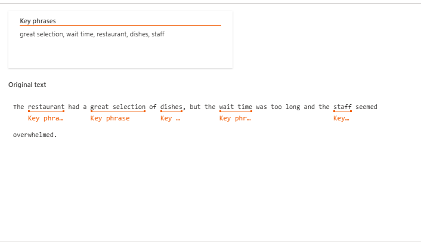
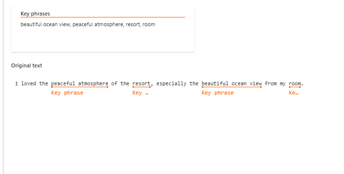
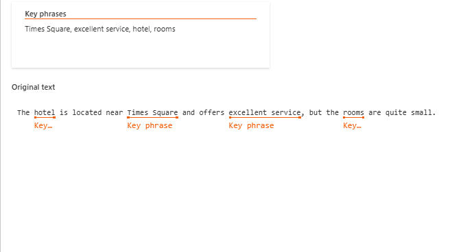

**Input 1**

**Input 2**

**Input 3**

## Insights Obtidos

- O Azure AI Language permite a análise automática de textos.
- A extração de entidades pode ser útil para classificação automática de reviews, bem como automatizar resumos de textos maiores e suas keys.
- A ferramenta pode ser aplicada em diversas áreas, como atendimento ao cliente e análise de sentimentos, sendo útil para o aprimoramento de hotéis e de tudo aquilo que envolve o reviews de consumidores.